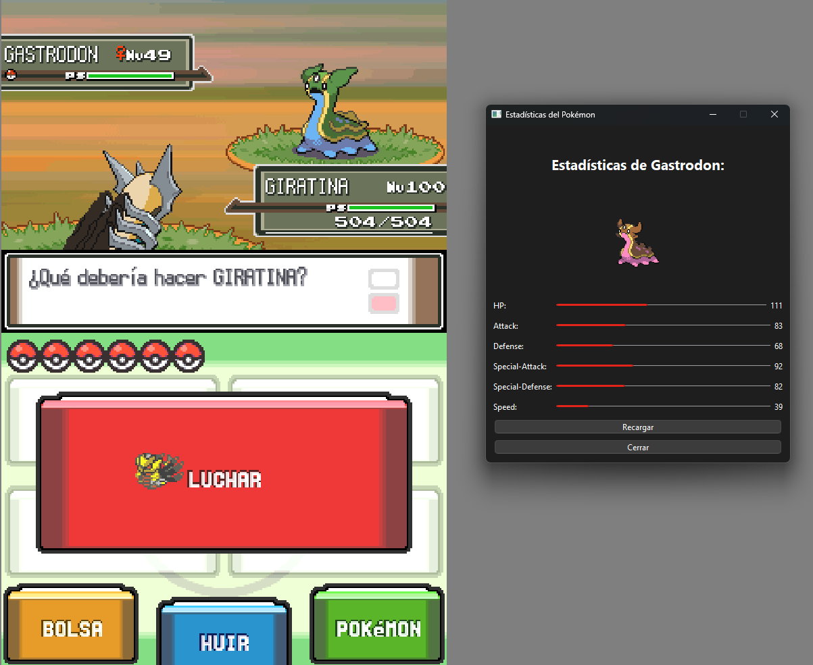

# PokeStats 🎮📊
Un programa diseñado para capturar información de combates en emuladores de GBA, Nintendo DS y Nintendo 3DS. PokeStats te muestra las estadísticas base de los Pokémon con gráficos visuales mientras juegas. Actualmente, **solo soporta el emulador DeSmuME** en su versión beta.

---

## 🖼️ Capturas de pantalla


---

## 📦 Instalación

### 1. Clona este repositorio
```bash
git clone https://github.com/genexix05/pokestats.git
cd pokestats
```

### 2. Configura un entorno virtual (opcional pero recomendado)
```bash
python -m venv env
# Activa el entorno virtual
# En Windows:
env\Scripts\activate
# En macOS/Linux:
source env/bin/activate
```

### 3. Instala las dependencias
Ejecuta el siguiente comando para instalar todas las dependencias necesarias:
```bash
pip install -r requirements.txt
```

---

## 🏁 Uso
### 1. Asegúrate de que el emulador DeSmuME esté ejecutándose.

La ventana debe estar visible en tu escritorio.

PokeStats detectará automáticamente la ventana.

### 2. Ejecuta la aplicación
```bash
python main.py
```

### 3. Selecciona el emulador

En la ventana de selección, elige DeSmuME (único disponible en esta versión).

### 4. ¡Empieza a buscar Pokémon!
Haz clic en el botón Empezar para activar la búsqueda.

Cuando se detecta un Pokémon, se mostrarán sus estadísticas base.

Usa el botón Recargar para buscar otro Pokémon.

---

## 🛠️ Requisitos

**Python 3.10+**

Emulador **DeSmuME** instalado y funcionando.

Conexión a internet para descargar datos desde PokeAPI.

---

## 📋 Características
**OCR integrado**: Detecta el nombre de los Pokémon directamente desde la ventana del emulador.

**Gráficos de stats**: Muestra las estadísticas base de cada Pokémon con barras visuales y valores.

**Compatibilidad**: Actualmente soporta solo DeSmuME (beta).
